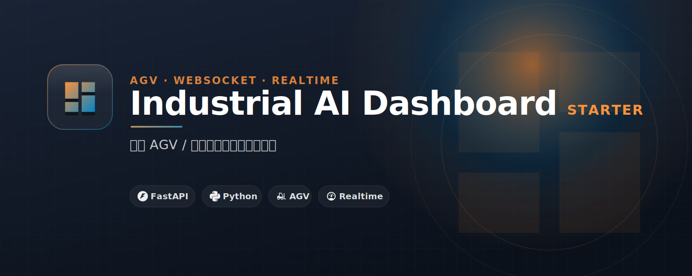

# Industrial AI Dashboard Starter

Realtime industrial dashboard starter for AGV, PLC and machine monitoring demos.

## 繁中定位

**工業 AI Dashboard 入門模板** 面向台灣繁中受眾。

- 主要受眾：適合自動化、AGV、PLC、工業 IoT 工程師，先做出可展示的 Web 監控介面。
- 核心承諾：先用模擬 AGV / machine data 做出 dashboard，再替換成 MQTT、ROS2、Modbus 或 PLC API。
- CTA 頁：https://yazelin.github.io/industrial-ai-dashboard-starter/


## 公開教學文件

這個 repo 的教學內容直接公開，讓你可以先自己照著跑；如果需要手把手 debug、改成你的公司或個人場景，再考慮工作坊或顧問協助。

- 網頁版教學：https://yazelin.github.io/industrial-ai-dashboard-starter/tutorial.html
- Markdown 教學：[`docs/`](docs/)
- 快速開始：[`docs/01-quickstart.md`](docs/01-quickstart.md)
- 常見踩雷：[`docs/05-common-pitfalls.md`](docs/05-common-pitfalls.md)

## Who this is for

Automation engineers who want web dashboards before connecting real factory data.

## Features

- FastAPI + WebSocket
- Zero-build HTML/CSS/JS UI
- Simulated AGV/machine data
- Adapter point for MQTT / ROS2 / Modbus

## Quick start

```bash
git clone https://github.com/yazelin/industrial-ai-dashboard-starter.git
cd industrial-ai-dashboard-starter
python -m venv .venv
source .venv/bin/activate
pip install -r requirements.txt  # if present
```

See the source files and `.env.example` for the minimal runnable path.

## Learn / get help

This repo is also a CTA page for workshops and consulting:

- GitHub Pages: https://yazelin.github.io/industrial-ai-dashboard-starter/
- Contact: yaze.lin.j303@gmail.com

## License

MIT


## Brand / CTA design

- Landing page: https://yazelin.github.io/industrial-ai-dashboard-starter/
- CI spec: [DESIGN.md](DESIGN.md)
- Banner: [assets/banner.svg](assets/banner.svg)
- Logo: [assets/logo.svg](assets/logo.svg)
